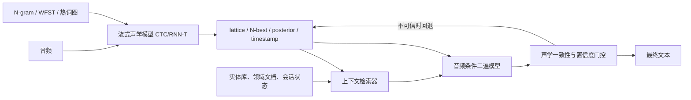

# ASR 语言模型前沿论文与系统路线（截至 2026-08-18）

这是一份会随研究进展更新的课程终章路线。它不是“按年份堆论文”，而是回答一个工程问题：**学会 N-gram、WFST 和 OpenFst 后，现代 ASR 语言模型应该怎样继续做？**

## 先给结论

综合 2025～2026 年的论文，一个可靠的现代 ASR 系统通常不应直接让文本 LLM 无约束地覆盖声学结果。更稳妥的路线是：

1. 使用流式 CTC/RNN-T/Transducer 与小型 N-gram/WFST 完成低延迟、可约束的一遍解码；
2. 保留 lattice、N-best、token posterior、时间戳和置信度，不要只留下 1-best 文本；
3. 从大规模实体库或领域文档中检索少量相关上下文，而不是把完整词表塞进 prompt；
4. 使用同时看到音频表示、CTC posterior 或 N-best 的模型做二遍 rescoring/deliberation；
5. 用最小编辑、声学一致性、置信度门控与可回退策略限制 LLM 幻觉；
6. 分开评测普通 WER/CER、实体错误率、数字/否定词错误、幻觉率、延迟、显存和流式稳定性。

这是对下面多篇论文的综合工程推断，不是任何单篇论文的原话。



## 为什么 OpenFst 和 N-gram 仍值得学

LLM 擅长长上下文、语义和领域知识，但第一遍解码还要求低延迟、可预测内存、硬约束、热词控制和稳定回退。N-gram/WFST 提供的正是这些能力。前沿方向更像是在它们上面增加新的语言信息，而不是让所有图算法消失。

学 OpenFst 还能让你准确理解：

- 一遍解码中语言分数怎样进入路径；
- lattice/N-best 到底保留了什么竞争假设；
- contextual biasing 为什么能作为图或分数组件加入；
- 二遍 LLM 为什么必须和 acoustic score、LM score 一起调权重；
- 何时可以回退到确定性的原始路径。

## 必读论文：从工程可落地到研究前沿

### A. 先理解“音频证据不能丢”

1. [ASR-EC Benchmark: Evaluating Large Language Models on Chinese ASR Error Correction](https://aclanthology.org/2025.emnlp-industry.110/)（EMNLP Industry 2025）
   - 中文 ASR 纠错基准；比较 prompting、微调和多模态增强。
   - 关键问题：文本提示为什么经常不能可靠纠错？加入音频后改善在哪里？

2. [Listen Again and Choose the Right Answer](https://aclanthology.org/2024.findings-acl.37/)（Findings of ACL 2024）
   - 指出只看 N-best 的生成式纠错可能产生与原音频不一致的文本，并重新引入语音证据。
   - 关键问题：怎样避免“语言上通顺、声音上错误”？

3. [Audio-Conditioned Diffusion LLMs for ASR and Deliberation Processing](https://arxiv.org/abs/2509.16622)（2025 预印本）
   - 研究音频条件 diffusion LLM；论文报告纯文本版本不能带来同样改善。
   - 关键问题：低置信 token mask、双向修复和非自回归解码是否适合二遍处理？

### B. 学会把 speech encoder 接到 LLM

4. [LegoSLM: Connecting LLM with Speech Encoder using CTC Posteriors](https://arxiv.org/abs/2505.11352)（2025；后收入 EMNLP Findings）
   - 用 CTC posterior 对 LLM token embedding 加权，形成 pseudo-audio embedding。
   - 关键问题：为什么 posterior 比硬 1-best token 保留更多声学不确定性？

5. [SEAM: Bridging the Temporal-Semantic Granularity Gap for LLM-based Speech Recognition](https://aclanthology.org/2026.findings-eacl.112/)（Findings of EACL 2026）
   - 讨论语音帧长度与文本语义 token 长度不一致的问题，并使用可变速率对齐模块。
   - 关键问题：adapter 不只是“降采样”，还必须解决怎样的分布错配？

6. [Speech LLMs are Contextual Reasoning Transcribers](https://arxiv.org/abs/2604.00610)（2026 预印本）
   - CTC-guided modality adapter 加 contextual reasoning，并关注 entity error rate。
   - 关键问题：推理过程带来真实声学收益，还是只增加文本先验和幻觉风险？复现时必须做消融。

7. [Multimodal In-context Learning for ASR of Low-resource Languages](https://aclanthology.org/2026.findings-acl.1239/)（Findings of ACL 2026）
   - 研究 speech LLM 在未见语言上的多模态 ICL；结果支持把强声学模型候选与 speech LLM 选择结合，而不是盲目依赖 prompt 直接识别。
   - 关键问题：低资源场景下，声学模型、上下文示例和语言先验应怎样分工？

8. [Rethinking Speech-LLM Integration for ASR: Effective Joint Speech-Text Training by Interleaving](https://arxiv.org/abs/2607.01733)（2026-07 预印本）
   - 提出 Joint Speech-Text Interleaved Pretraining（JSTIP），在对齐语音文本中构造词级和片段级交错序列，重点研究实体识别与领域文本利用。
   - 关键问题：语音和文本仅做普通联合训练时，LLM 的文本知识为什么可能没有被充分使用？

9. [Towards Deep Contextual Reasoning from Broad Descriptions for ASR with Speech-LLM via Metadata-Driven Reasoning Chains](https://arxiv.org/abs/2606.10838)（2026-06 预印本）
   - 使用视频等宽泛元数据构造推理增强语音数据，让模型先形成初始转写，再结合上下文推理和纠错。
   - 关键问题：宽泛上下文怎样改善稀有实体，同时避免把“相关但没有说出”的内容写进转录？

### C. 学会检索、实体和领域适配

10. [RECAST: Retrieval-Augmented Contextual ASR via Decoder-State Keyword Spotting](https://aclanthology.org/2025.findings-emnlp.203/)（Findings of EMNLP 2025）
   - 用 ASR decoder state 检索大词典中的相关 keyword，再把少量结果提供给下游 speech LM。
   - 关键问题：为什么“先检索再偏置”比完整 bias list 更适合大实体库？

11. [Failing Forward: Improving Generative Error Correction for ASR with Synthetic Data and Retrieval Augmentation](https://aclanthology.org/2025.findings-acl.125/)（Findings of ACL 2025）
   - 使用合成 ASR 错误扩充训练数据，并检索实体辅助生成式纠错。
   - 关键问题：怎样生成像真实 decoder 的错误，而不是普通拼写错误？

12. [Retrieval Augmented Generation based context discovery for ASR](https://aclanthology.org/2025.findings-emnlp.768/)（Findings of EMNLP 2025）
    - 比较 embedding retrieval、LLM 上下文生成和 LLM 后纠错。
    - 关键问题：上下文应该在解码前发现、解码中注入，还是解码后纠错？

### D. 学会生成式纠错和可靠性评测

13. [CoVoGER: A Multilingual Multitask Benchmark for Speech-to-text Generative Error Correction with Large Language Models](https://aclanthology.org/2025.emnlp-main.320/)（EMNLP 2025）
    - 覆盖多语言 ASR 与语音翻译的 N-best 生成式纠错。
    - 关键问题：候选多样性怎样影响 GER？beam 与 sampling 的候选应怎样组合？

14. [NeKo: Cross-Modality Post-Recognition Error Correction with Tasks-Guided Mixture-of-Experts Language Model](https://aclanthology.org/2025.acl-industry.17/)（ACL Industry 2025）
    - 用多任务 MoE 做跨模态识别后纠错。
    - 关键问题：专门的纠错模型是否比通用大模型更便宜、更稳定？

15. [Detecting Hallucinations in SpeechLLMs at Inference Time Using Attention Maps](https://aclanthology.org/2026.findings-acl.2147/)（Findings of ACL 2026）
    - 用音频/文本 attention 特征检测 SpeechLLM 幻觉。
    - 关键问题：没有参考答案时，线上系统怎样拒绝或回退？

16. [VAPO: End-to-end Slide-Enhanced Speech Recognition with Omni-modal Large Language Models](https://aclanthology.org/2026.acl-long.425/)（ACL 2026）
    - 研究幻灯片视觉文本辅助 ASR，同时专门处理“看见但没有说出”的视觉干扰。
    - 关键问题：上下文增强为什么会引入新的 hallucination 类型？

### E. 用综述建立全局地图

17. [Recent Advances in Speech Language Models: A Survey](https://aclanthology.org/2025.acl-long.682.pdf)（ACL 2025）
    - 覆盖 SpeechLM 架构、训练、评测与挑战。
    - 阅读时重点区分：级联 ASR+LLM、speech encoder + adapter + LLM、离散 speech token LM，以及端到端 speech-to-speech 模型。

## 推荐的实现阶梯

不要第一步就训练 SpeechLLM。按以下阶梯，每一步都保留可比较的基线。

### 阶段 1：可控基线

- CTC 或 RNN-T 一遍模型；
- N-gram/WFST 解码；
- 输出 10～50 best、acoustic score、LM score、token posterior；
- 建立 WER/CER、实体错误率、RTF 和峰值内存基线。

### 阶段 2：文本 LM/LLM 重打分

对每个候选计算：

```text
score = λa * acoustic_score
      + λn * ngram_score
      + λl * neural_or_llm_score
      + λc * context_score
      + insertion_penalty
```

所有权重只在 validation set 调，不看 test set。先做“只重排、不生成新文本”，这样风险最小，也最容易判断 LLM 是否真的利用语言信息。

### 阶段 3：检索式上下文

- 维护名称、产品、地点、专业词实体库；
- 从 decoder state、音素近似或当前文本检索 top-k；
- 同时比较 contextual FST/hotword、LLM prompt 和二者结合；
- 单独报告 entity recall、entity WER 和误触发率。

### 阶段 4：音频条件 deliberation / GER

- 输入 N-best + acoustic score + 低置信位置；
- 同时输入音频 embedding 或 CTC posterior；
- 训练目标强调 minimal edit 和 acoustic consistency；
- 只在置信门控通过时接受生成结果，否则回退原候选。

### 阶段 5：Speech encoder + adapter + LLM

研究 CTC-posterior adapter、可变速率对齐和 LoRA。必须与阶段 1～4 在相同数据、参数预算和延迟约束下比较。不要只报告通用测试集 WER，还要报告跨域、噪声、口音、实体和幻觉。

## 最小实验矩阵

| 系统 | 音频证据 | 可生成新文本 | 上下文 | 主要目的 |
|---|---|---:|---|---|
| CTC + WFST | 完整 | 否 | N-gram/热词图 | 稳定基线 |
| N-best + neural LM | 间接 | 否 | 文本语料 | 重打分收益 |
| N-best + text LLM | 间接 | 否 | 长文本 | 长上下文重排 |
| text-only GER | 无直接音频 | 是 | N-best/检索 | 测量误改与幻觉 |
| audio-conditioned GER | 有 | 是 | N-best/检索 | 前沿二遍方案 |
| speech encoder + adapter + LLM | 有 | 是 | prompt/检索 | 研究型端到端方案 |

## 必须记录的指标

- WER、CER；
- named-entity WER / entity recall；
- 数字、日期、否定词、人名的专项错误率；
- hallucination / unsupported insertion rate；
- oracle N-best WER：判断候选集合是否已经包含正确答案；
- rescoring gain 与 GER gain 分开统计；
- latency、RTF、首字延迟、峰值内存/显存；
- streaming revision 次数和最终稳定时间；
- 置信度校准与门控后的 coverage-risk 曲线。

## 课程中的阅读顺序

1. 完成 N-gram、OpenFst、ARPA 和 lattice 基础；
2. 阅读 ASR-EC 与 Listen Again，先建立“不能丢声学证据”的意识；
3. 阅读 LegoSLM、SEAM，理解 speech/LLM 对齐；
4. 阅读 RECAST，理解检索式 contextual ASR；
5. 阅读 CoVoGER、NeKo，比较 rescoring 和 generative correction；
6. 阅读 2026 幻觉检测工作，设计门控与回退；
7. 最后选择一条路线做复现实验，不同时追逐全部模型。

最终项目的目标不是“接入一个 LLM API”，而是用严格对照实验证明：新模块在哪些样本上改善了什么、付出了多少延迟、何时会误改，以及系统怎样安全回退。
