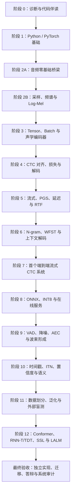

# Learn ASR 唯一学习路径

这条路线面向“理论基础较弱，但希望最终能够独立理解、实现、评测和部署语音识别系统”的学习者。它不是按文件数量机械排序，而是按能力依赖重新编排。

课程的目标不是“把 Notebook 全部运行一遍”，而是逐步取得五类可验证证据：

1. **知识**：能闭卷解释概念、公式、shape、单位和边界；
2. **实现**：能从空白写出核心函数，而不是复制答案；
3. **排错**：能定位数据、维度、状态、解码和性能问题；
4. **迁移**：能把方法应用到新音频、新说话人和新运行环境；
5. **表达**：能口述完整系统，并说明结论有哪些证据、哪些局限。

总入口是 [`notebooks/README.md`](notebooks/README.md)。根目录中的 Notebook 是学习版；完整运行输出统一放在 [`notebooks/_executed/`](notebooks/_executed/README.md)，只在卡住时对照。

## 1. 整体路线



CTC、流式、PGS、RTF、语言模型、WFST、量化部署、麦克风前端和语义模块全部属于必修主干。前沿大模型的真实微调受 GPU、数据许可和下载条件影响，但架构、实验设计、基线与验收方法仍是必修。

## 2. 需要多久

时间取决于“看完”还是“掌握”。对当前从基础重新学习的目标，建议按标准节奏执行。

| 目标 | 预计投入 | 每周 8 小时 | 每周 12 小时 | 能力边界 |
|---|---:|---:|---:|---|
| 第一遍完成 | 190～255 小时 | 24～32 周 | 16～22 周 | 能运行、能复述主要概念 |
| 独立实现 | 335～470 小时 | 42～59 周 | 28～40 周 | 能闭卷实现、排错和评测教学系统 |
| 扎实掌握 | 470～680 小时 | 59～85 周 | 40～57 周 | 能迁移到新数据并完成工程验收 |

推荐目标：**用 36～48 周，每周 10～12 小时完成第一轮掌握**。不要用“连续观看时间”计算进度，只计算亲手推导、编码、实验、复习和答辩的时间。

## 3. 十三个学习阶段（阶段 0～12）

### 阶段 0：诊断、工具和代码伴读

- 学习材料：[`学习中枢`](notebooks/学习中枢_诊断与掌握度仪表盘.ipynb)、[`零基础逐行代码伴读`](notebooks/代码伴读_零基础逐行理解ASR.ipynb)。
- 重点：怎样读一个 cell、变量和函数、shape、dtype/device、报错栈、修改一个参数后重新运行。
- 建议时间：4～8 小时。
- 产出：在 [`LEARNING_LOG.md`](LEARNING_LOG.md) 记录诊断结果和最早知识断点。
- 离场标准：能解释一段 10～20 行代码的数据流，并独立修改、运行和恢复一个参数。

如果代码已经能熟练阅读，可快速完成诊断后跳过伴读；不能因为“代码运行成功”而跳过诊断。

### 阶段 1：Python、Tensor 与训练循环

- 学习材料：[`PyTorch 零基础路线`](notebooks/PyTorch零基础课程索引.md)中的基础 01～06。
- 重点：函数、索引、广播、矩阵乘法、autograd、`nn.Module`、optimizer、`Dataset`、`DataLoader`、padding 和 mask。
- 建议时间：20～32 小时。
- 必做实现：单位换算、Tensor shape 推导、最小训练循环、变长 batch `collate_fn`。
- 离场标准：看到 `[B,T,F]` 能说清每个轴；能从空白写训练一步并解释 `zero_grad/backward/step` 的顺序。

### 阶段 2：从声音直觉到采样、FFT、STFT 与 Log-Mel

- 学习材料：先完成 [`音频零基础 6 节桥梁课`](notebooks/音频零基础课程索引.md)、[`专业音频软件分析实验`](AUDIO_SOFTWARE_GUIDE.md)和 [`24 条音频问题盲诊断`](AUDIO_DIAGNOSIS_PRACTICE.md)，再学习主线 01～06。
- 重点：先建立振动、波形、周期、相位、peak/RMS、功率/dB、采样、量化、PCM、位深、通道、叠加、谐波、噪声与 SNR；再进入 Nyquist、混叠、frame/window/hop、DFT/FFT、STFT、Mel、Log-Mel。
- 建议时间：桥梁课 12～18 小时，软件实验 6～10 小时，盲诊断 8～14 小时，主线 24～36 小时。
- 固定解释框架：每个量都必须说清“物理含义、单位、数组表示、参数变化”；只会背术语或运行代码不能通关。
- 必做入口审计：读取一条真实 WAV，报告采样率、通道、dtype、shape、时长、peak、RMS、DC、clipping 与有限性。
- 必做软件实验：用 Audacity 完成波形/声谱图/频谱/DC/剪切/噪声分析；用 Praat 完成 F0、Formant、Intensity 和 TextGrid；用 `manifest.json` 与 Notebook 对同一校准音频三方核对。
- 必做盲诊断：24 条题按 beginner/intermediate/advanced 完成至少 19 条；每条必须写主诊断、置信度、两项独立证据、替代解释、对 ASR 的影响和非破坏性下一步检查。
- 必做实验：同一条真实音频分别画波形、单帧频谱、线性声谱图和 Log-Mel；改变采样率、窗长、hop 并预测变化。
- 必做实现：`sample_count`、peak/RMS、dB 换算、目标 SNR 混音、WAV 审计、分帧、窗函数、FFT 频率轴、Log-Mel 前端。
- 离场标准：能从声源振动讲到 `wav [N]`，再手算到特征 `[T,F]` 的每一步 shape、单位和时间分辨率；能解释采样与量化、幅度与功率、dB 与 dBFS、频率与频率 bin 的区别。

### 阶段 3：Batch、Mask、Conv1d 与声学编码器

- 学习材料：主线 07～09。
- 重点：padding 不等于有效语音、length/mask 合同、`Conv1d` 的 channel/time 顺序、感受野和时间下采样。
- 建议时间：16～24 小时。
- 必做实现：变长 batch、mask、最小编码器、卷积输出长度计算。
- 离场标准：改变 batch padding 不会改变有效帧 logits；能计算多层卷积后的时间长度和感受野。

### 阶段 4：CTC——本课程第一核心

- 学习材料：主线 10～14，随后完成 [`CTC 可视化实验室`](notebooks/专题_CTC可视化实验室_从路径到流式解码.ipynb)。
- 重点：blank、重复 token、路径到文本的 many-to-one 映射、前向动态规划、log-sum-exp、`CTCLoss` shape/length、greedy 与 prefix beam。
- 建议时间：36～55 小时。
- 必做实现：CTC collapse、可穷举小例子、log-space 前向算法、greedy、prefix beam、CER 编辑距离。
- 必做排错：`input_length < target_length`、时间维/批维颠倒、padding 进入 loss、重复字符被错误合并。
- 离场标准：不用 API 也能解释并实现小规模 CTC 前向；能证明 PyTorch loss 与手算/穷举一致；能解释 beam 为什么不能只保留一个最佳路径。

第 14 课的小数据训练只证明链路和梯度可用，不能当作泛化准确率。

### 阶段 5：流式、PGS、延迟与 RTF——本课程第二核心

- 学习材料：主线 15～18，随后完成 [`流式 ASR 实验室`](notebooks/专题_流式ASR实验室_Chunk缓存PGS与实时率.ipynb)。
- 重点：chunk、特征尾巴、因果卷积缓存、有限右上下文、解码状态、partial/final、`apd/rpl/rg`、RTF、首字延迟、尾延迟和 P95/P99。
- 建议时间：28～42 小时。
- 必做实现：跨 chunk CTC collapse、流式特征缓存、流式模型 cache、PGS 事件应用器、固定线程 benchmark。
- 必做实验：比较至少三种 chunk 大小的质量、RTF、调用次数和延迟；验证整段与分块结果一致。
- 离场标准：能区分音频时钟与计算时钟；能解释 `RTF < 1` 为什么仍不保证低首字延迟；能定位重复 partial、断句错误和 cache 污染。

### 阶段 6：语言模型与 WFST——本课程第三核心

这一阶段将两条原本重复的路线交错学习：

1. 语言模型专修 01～02 → 主线 19～20：Bigram、平滑、OOV、困惑度、浅融合与热词；
2. 语言模型专修 03～06 → 主线 21～22：FSA/FST、OpenFst、ARPA、`L/G`、消歧、`HCLG/CTC-TLG`；
3. 语言模型专修 07 → 主线 23：N-best、lattice、分数融合、流式 token passing；
4. 主线 24 → 语言模型专修 08：综合系统、开发集调参、冻结测试集和闭卷验收；
5. 最后完成 [`WFST 实验室`](notebooks/专题_WFST实验室_从L与G到流式TokenPassing.ipynb)。

- 依赖：语言模型 03～08 的真实 OpenFst/KenLM 实验需要按 [`ASR_LM_ENVIRONMENT.md`](ASR_LM_ENVIRONMENT.md) 配置 WSL。
- 建议时间：45～70 小时。
- 必做实现：Add-k/backoff 概率、困惑度、prefix 分数融合、小型 FST、组合、token passing、N-best 重打分。
- 离场标准：能解释 acoustic/LM/insertion/hotword 四类分数；能画出并调试小型 `L∘G`；只在开发集选择 LM scale，测试集只评分一次。

### 阶段 7：首个完整流式 CTC 系统

- 学习材料：[`实时数字 CTC 结课项目`](notebooks/结课项目_实时数字CTC声学引擎_从WAV到流式文本.ipynb)和 [`learning_workspace/`](learning_workspace/README.md)。
- 建议时间：24～40 小时。
- 任务：贯通 WAV、Log-Mel、变长 batch、CTC 训练、greedy/prefix beam、Bigram、流式 cache、CER 与 RTF。
- 离场标准：六个编码关卡全部通过；从干净进程加载 checkpoint；整段/分块合同、错误输入和重复 token 均有测试。

这是第一个系统里程碑，不是最终毕业。它证明你可以把前六阶段连成可运行系统。

### 阶段 8：模型导出、量化和在线部署

- 学习材料：主线 25～30和 [`量化部署实验室`](notebooks/专题_量化部署实验室_ONNX_INT8性能与服务验收.ipynb)。
- 重点：ONNX 导出、动态轴、数值一致性、INT8 PTQ/QAT、校准集、HTTP/WebSocket、会话隔离、并发、监控和回滚。
- 建议时间：28～42 小时。
- 必做实验：FP32/INT8 的大小、延迟、RTF 和误差对比；两个并发流不能共享 cache；错误采样率必须被拒绝。
- 离场标准：能给出质量—延迟—体积权衡表，并说明 benchmark 是否包含 I/O、预处理、warmup 和线程设置。

### 阶段 9：麦克风前端

- 学习材料：主线 31～36和 [`音频前端实验室`](notebooks/专题_音频前端实验室_质量VAD_AEC与波束形成.ipynb)。
- 重点：PCM/通道/幅值/DC/削波/重采样、SNR/降噪/AGC、VAD/endpoint、AEC/double-talk、多麦波束形成和状态总管线。
- 建议时间：28～42 小时。
- 必做实验：把同一段语音注入噪声、削波、DC、回声和延迟，观察波形、频谱、VAD、ERLE/SNR 与 ASR 输出。
- 离场标准：前端优化必须同时报告信号指标和 CER/WER；能解释“听起来更干净”为什么不一定识别更好。

### 阶段 10：时间戳、置信度、文本与语义

- 学习材料：主线 37～41和 [`语义后处理实验室`](notebooks/专题_语义后处理实验室_时间戳ITN置信度与安全执行.ipynb)。
- 重点：时间戳、diarization、标点、ITN、置信度校准、N-best、语义重排、意图/槽位、受约束 LLM 和安全执行。
- 建议时间：24～36 小时。
- 必做实验：保留 raw ASR、normalized text、confidence 和 semantic action 四层证据；低置信度危险操作必须确认或拒绝。
- 离场标准：语义模块不能静默改写不确定数字、姓名、金额或命令；能设计可审计 schema 和失败回退。

### 阶段 11：泛化、泄漏和外部盲测

按下列顺序完成：

1. [`FSDD 说话人泛化`](notebooks/专题_FSDD说话人泛化实验_数据划分增强与盲测.ipynb)：认识随机切分造成的说话人泄漏；
2. [`FSDD 六折 LOSO`](notebooks/专题_FSDD六折LOSO_嵌套选择与说话人统计.ipynb)：每位说话人轮流作为一次外层测试；
3. [`AudioMNIST 外部盲测`](notebooks/专题_AudioMNIST外部盲测_冻结协议跨域失败与适配边界.ipynb)：先冻结协议和模型，再接触外部数据并发布失败结果。

- 建议时间：32～50 小时。
- 重点：train/dev/test 权限、speaker-disjoint、嵌套选择、micro/macro、置信区间、S/D/I、域偏移和 score-once 原则。
- 离场标准：能审计一项实验是否发生数据泄漏；任何性能结论都能指向固定数据、模型、指标和不可覆盖结果。

### 阶段 12：现代模型与前沿系统

- 学习材料：主线 42～46、语言模型专修 09、[`FRONTIER_ASR_2026.md`](FRONTIER_ASR_2026.md)和 [`FRONTIER_ASR_LM_READING.md`](FRONTIER_ASR_LM_READING.md)。
- 顺序：Conformer → RNN-T/TDT → 自监督语音预训练 → AudioEncoder/projector/LLM → Qwen3-ASR 推理、微调与验收。
- 建议时间：36～60 小时；真实大模型实验另计 GPU 时间。
- 离场标准：能比较 CTC、RNN-T、AED 和 LALM 的对齐、状态、延迟、数据和幻觉风险；能为目标场景提出可测量而非只凭模型名的选型方案。

## 4. 每一课怎样学

一次学习控制在 90～150 分钟：

1. **闭卷前测 10 分钟**：先回答 3 道诊断题；
2. **知识接力 3～5 分钟**：闭卷取回上一课要求的概念、单位和 shape；断点超过一项时先补最小实验；
3. **概念 20～30 分钟**：只学一个因果链，写出输入、输出、shape、单位；
4. **预测 10 分钟**：运行前画图或预测数值；
5. **实验 30～45 分钟**：每次只改一个变量，保留失败结果；
6. **编码 20～40 分钟**：隐藏答案，从空白 cell 写核心函数；
7. **复盘 10 分钟**：在学习日志写“原判断—证据—正确规则”；
8. **间隔复习**：第 1、7、30 天各做一次不看答案的短测。

卡住时按以下顺序处理：读报错最后一行 → 打印 type/shape/dtype/device/range → 构造最小输入 → 查同名运行对照 → 再提问。不要连续复制多个修复，避免不知道哪一步真正解决了问题。

## 5. 阶段门禁

阶段得分采用 0～4 级：

| 等级 | 证据 |
|---:|---|
| 0 | 陌生，无法说出输入输出 |
| 1 | 看答案能理解 |
| 2 | 闭卷能解释、计算和预测 |
| 3 | 能从空白实现并排错 |
| 4 | 能迁移到新数据，并主动说明证据边界 |

进入下一阶段前，当前阶段至少达到 3，所有前置阶段不得低于 2。最终“掌握”还要求五道总门禁全部通过：

```powershell
uv run python -m acoustic_engine.tutor
uv run python -m acoustic_engine.challenge --status
uv run python -m acoustic_engine.mastery --status
uv run python -m acoustic_engine.mastery --system-audit
```

五道总门禁分别是：知识检查、亲手编码、完整执行的结课 Notebook、新输入上的迁移与故障注入、闭卷口述答辩。自动测试通过只是实现证据之一，不等于已经掌握。

## 6. 每周安排

标准每周 10～12 小时：

| 时间块 | 内容 |
|---|---|
| 2 × 2 小时 | 新课概念、图和交互实验 |
| 2 × 2 小时 | 练习、闭卷实现和排错 |
| 1 × 2 小时 | 阶段项目、真实音频或 benchmark |
| 1 × 1 小时 | 第 1/7/30 天间隔复习 |
| 1 小时 | 整理学习日志、提交代码和口述复盘 |

每四周安排一个“缓冲周”：不学新课，只补错题、重写核心函数、整理实验报告和修复测试。

## 7. 现在从哪里开始

1. 在项目根目录执行 `uv sync --locked` 和 `uv run jupyter lab`；
2. 打开 [`学习中枢`](notebooks/学习中枢_诊断与掌握度仪表盘.ipynb)完成诊断；
3. 如果 Python/shape/训练代码读起来吃力，完成[`代码伴读`](notebooks/代码伴读_零基础逐行理解ASR.ipynb)；
4. 从 [`PyTorch 零基础路线`](notebooks/PyTorch零基础课程索引.md)开始阶段 1；
5. 每次学习都在 [`LEARNING_LOG.md`](LEARNING_LOG.md)记录证据，不用一次回答所有历史题目。

路线允许慢，但不允许用“Notebook 已运行”代替“我已经掌握”。
